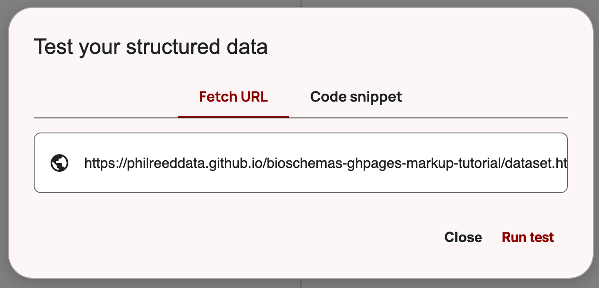
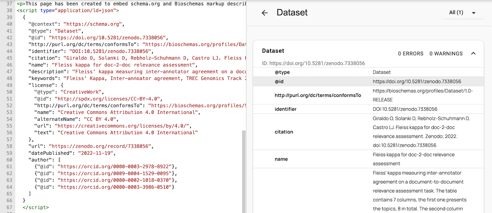
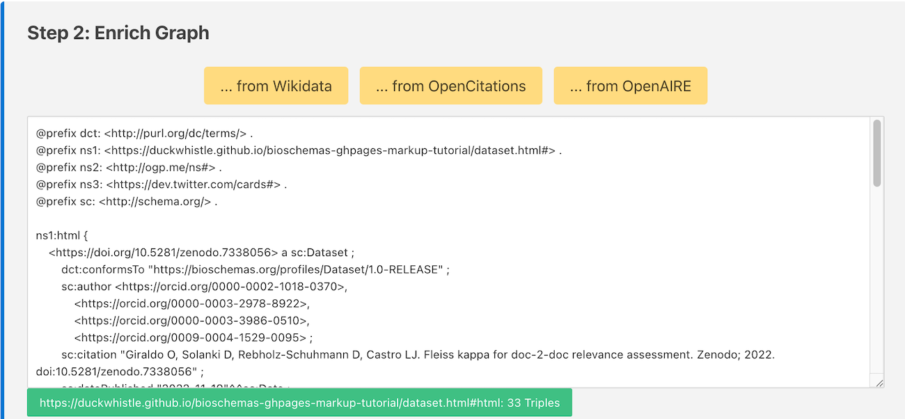

# GitHub pages with Bioschemas markup

These GitHub pages include a page describing a [software](./software.md) and a page describing a [dataset](./dataset.md) that was created as an output from the software at hand.

## Overview
* __Name:__ Tutorial on adding Bioschemas markup to GitHub pages
* __Description:__ This tutorial shows how to add Bioschemas markup to GitHub pages. It uses a simple GitHub page hosted in the gh-pages branch to create a sample project page, i.e., as learners could do with their own GitHub projects. As an example, it uses the software and data corresponding to the released project [TREC-doc-2-doc-relevance](https://github.com/zbmed-semtec/TREC-doc-2-doc-relevance), a web-based interface to add document-to-document relevance assessments to pairs of documents retrieved from [TREC 2005 Genomics Track](https://trec.nist.gov/data/genomics/05/genomics.qrels.large.txt). 
* __Keywords:__ Bioschemas, schema.org, structured markup, GitHub pages

 __Questions__
* How can I add Bioschemas markup to GitHub pages?
* Can I also use schema.org types not included in Bioschemas?
* How can I use Bioschemas profiles? In particular [Dataset](https://bioschemas.org/profiles/Dataset/1.1-DRAFT) (bonus, we also use [TrainingMaterial](https://bioschemas.org/profiles/TrainingMaterial/1.0-RELEASE) to describe the tutorial itself). 
  * Advanced learners may also use the [ComputationalTool](https://bioschemas.org/profiles/ComputationalTool/1.0-RELEASE) profile; see the [original lesson](https://github.com/zbmed-semtec/bioschemas-ghpages-markup-tutorial).

 __Learning outcomes__
* Describe how schema.org and Bioschemas markup can be embedded to GitHub pages
* Use schema.org and Bioschemas profiles on GitHub pages
* Use schema and Bioschemas validators

 __Requirements__
* Understanding of what is Bioschemas and what are Bioschemas types and profiles
* Familiarity on how to use GitHub 
* Basic knowledge on how to use GitHub pages. More information at [GitHub Pages](https://pages.github.com/)
* Familiarity with JSON-LD
* Basic knowledge on Markdown
* Knowledge of develop tools on a browser

 __Time estimation__ 30 minutes

 __Level__ Beginner / Introductory

 __Published__ 2024-02-05

 __Latest modification__ 2025-07-26

 __License__ [CC-By 4.0](https://spdx.org/licenses/CC-BY-4.0)

 __Version__ Forked from 1.1.0 for the purpose of ACM REP '25

 __Identifier__ [DOI:10.5281/zenodo.13799121](https://doi.org/10.5281/zenodo.13799121)

 __Citation__ Castro, LJ. (2024). Adding Bioschemas Dataset and ComputationalTool markup to GitHub pages. Zenodo. https://doi.org/10.5281/zenodo.13799121

## Learning experience

### Agenda
In this tutorial we will cover:
- [GitHub pages with Bioschemas markup](#github-pages-with-bioschemas-markup)
  - [Overview](#overview)
  - [Learning experience](#learning-experience)
    - [Agenda](#agenda)
    - [What are we aiming for?](#what-are-we-aiming-for)
    - [Creating this GitHub Page](#creating-this-github-page)
    - [Adding schema.org and Bioschemas markup](#adding-schemaorg-and-bioschemas-markup)
      - [Using schema.org types](#using-schemaorg-types)
      - [Using Bioschemas profiles](#using-bioschemas-profiles)
    - [Visualizing the structured markup](#visualizing-the-structured-markup)
    - [Validating the pages against the Schema Validator](#validating-the-pages-against-the-schema-validator)
    - [Validating the pages against the Rich Results Test](#validating-the-pages-against-the-rich-results-test)
    - [Validating the pages against FAIR-Checker/Bioschemas validator](#validating-the-pages-against-fair-checkerbioschemas-validator)
    - [Creating a Sitemap](#creating-a-sitemap)
    - [Try it out](#try-it-out)
  - [What is next?](#what-is-next)
  - [Acknowledgements](#acknowledgements)

### What are we aiming for?

It may help you to understand the purpose of these activities if we should you what we are aiming to do. 

1. We are going to add Bioschemas markup to webpages that have been written about data, software, training materials, or many other kinds of research output. 
2. These webpages are hosted on the GitHub Pages platform, but they could be hosted anywhere.
3. We will then use tools to validate that we have added the markup correctly.
4. After completing this tutorial, you will be able to make your research output more discoverable. 

### Creating this GitHub Page
Let's start by forking [this repository](https://github.com/philreeddata/bioschemas-ghpages-markup-tutorial) for your own purposes. Once forked, go to settings


1. You will need to enable "Pages" on your forked repository.
2. Select under Source `Deploy from a branch`. 
3. Use the `main` branch and the folder `/docs`. 
4. `Save` your changes.


In a matter of minutes, your site will be live. The pages corresponding to the examples used in this tutorial are available at [https://philreeddata.github.io/bioschemas-ghpages-markup-tutorial/](https://philreeddata.github.io/bioschemas-ghpages-markup-tutorial/). They will have no markup to start with, you will add it in a moment.


Do not forget to get a local copy of your fork so you can make changes, or work in the browser. There are several ways to do this:
- Clone the repository on the command line with [Git](https://docs.github.com/en/get-started/git-basics/set-up-git)
- Clone the repository with [GitHub Desktop](https://docs.github.com/en/desktop)
- Use the [github.dev web-based editor](https://docs.github.com/en/codespaces/the-githubdev-web-based-editor) 
- Edit individual files on GitHub.com (most suitable for Git beginners)

### Adding schema.org and Bioschemas markup
We will add schema.org and Bioschemas markup corresponding to our example, code (software page) and data (dataset page) for our repo [TREC-doc-2-doc-relevance](https://github.com/zbmed-semtec/TREC-doc-2-doc-relevance). Right now those pages only have text, with the following steps you will get schema.org/Bioschemas markup embedded in your pages. 

With GitHub Pages, same a with regular HTML (static or generated), the trick is adding the JSON-LD describing those elements that you want. To do so, you need to add a block `<script type="application/ld+json">` with the Bioschemas markup as a JSON-LD inside the block.

The Bioschemas markup will start with the context `"@context": "https://schema.org"`, i.e., where all types and profiles are defined.

Then you add the type and id of what you are describing, for instace a `bioschemas:ComputationalTool`. The `"http://purl.org/dc/terms/conformsTo"` is the bit that indicates that you are using Bioschemas.

```
    "@type": "Dataset", 
    "@id": "https://doi.org/10.5281/zenodo.7338056",
    "conformsTo": "https://bioschemas.org/profiles/Dataset/1.0-RELEASE"
```

For the rest of the markup, you need to see what the Bioschemas profile recommends ([keep reading, more information below](#using-bioschemas-profiles)).

To get the markup added to your pages, copy the content of [software](./software.md) to the [software page under /docs folder](./docs/software.md). Then copy the content of [dataset](./dataset.md) to the [dataset page under /docs folder](./docs/dataset.md)

Have a look to the pages that you just created on your own GitHub pages, one for the [code and corresponding release](https://philreeddata.github.io/bioschemas-ghpages-markup-tutorial/software), another for a [dataset created from data collected by the software](https://zphilreeddata.github.io/bioschemas-ghpages-markup-tutorial/dataset). To see them working for your repo (that will now have the schemas.org/Bioschemas markup), you need to use `<your_user>/<your_repo>` instead of `philreeddata.github.io/bioschemas-ghpages-markup-tutorial` on the html link `https://philreeddata.github.io/bioschemas-ghpages-markup-tutorial/dataset`.

The [dataset page](https://philreeddata.github.io/bioschemas-ghpages-markup-tutorial/dataset) in your repo should now have markup for one element, a dataset.

```html
<script type="application/ld+json">
  
  {
    "@context": "https://schema.org", 
    "@type": "Dataset",
    "@id": "https://doi.org/10.5281/zenodo.7338056",
    "conformsTo": "https://bioschemas.org/profiles/Dataset/1.0-RELEASE", 
    "identifier": "DOI:10.5281/zenodo.7338056",
    "citation": "Giraldo O, Solanki D, Rebholz-Schuhmann D, Castro LJ. Fleiss kappa for doc-2-doc relevance assessment. Zenodo; 2022. doi:10.5281/zenodo.7338056",
    "name": "Fleiss kappa for doc-2-doc relevance assessment",
    "description": "Fleiss' kappa measuring inter-annotator agreement on a document-to-document relevance assessment task. The table contains 7 columns, the first one presents the topics, 8 in total. The second column shows the \"reference articles\", represented by their PubMed-ID and organized by topic. The third column shows the Fleiss’ Kappa results. The fourth column shows the interpretation of the Fleiss' Kappa results being: i) \"Poor\" results <0.20, ii) \"Fair\" results within 0.21 - 0.40, and iii) \"Moderate\" results within 0.41 - 0.60. The fifth column shows the PubMed-IDs of evaluation articles rated by the four annotators as \"Relevant\" regarding its corresponding \"reference article\". The sixth column shows the PubMed-IDs of evaluation articles rated by the four annotators as \"Partially relevant\" regarding its corresponding \"reference article\". The seventh column shows the PubMed-IDs of evaluation articles rated by the four annotators as \"Non-relevant\" regarding its corresponding \"reference article\".",
    "keywords": "Fleiss' Kappa, Inter-annoator agreement, TREC Genomics Track 2005, relevance assessment", 
    "license": {
      "@type": "CreativeWork",
      "@id": "http://spdx.org/licenses/CC-BY-4.0",
      "name": "Creative Commons Attribution 4.0 International", 
      "alternateName": "CC BY 4.0",
      "url": "https://creativecommons.org/licenses/by/4.0/"
    },
    "url": "https://zenodo.org/record/7338056",
    "datePublished": "2022-11-19",
    "author": [                
      {"@id": "https://orcid.org/0000-0003-2978-8922"},
      {"@id": "https://orcid.org/0009-0004-1529-0095"},
      {"@id": "https://orcid.org/0000-0002-1018-0370"},
      {"@id": "https://orcid.org/0000-0003-3986-0510"}
    ]
  }
</script>
```

The [software page](https://philreeddata.github.io/bioschemas-ghpages-markup-tutorial/software) in your repo should now have markup for two elements, `schema:SoftareSourceCode` and `bioschemas:ComputationalTool`. If you have additional time, see the [original lesson for an explanation](https://github.com/zbmed-semtec/bioschemas-ghpages-markup-tutorial). Note that there is a workaround being applied for the `@id` and `schema:url` properties, since they cannot have the same value.


#### Using schema.org types
If you use a schema.org type that has a corresponding Bioschemas profile, we recommend using the Bioschemas profile as it will help you focus on the most common and useful properties. However, if there is a type in schema.org that does not have a Bioschemas profile, we suggest finding examples on how others have used them for a case similar to yours.

In this case we have used `schema:SoftwareSourceCode` with some properties that are also present for `bioschemas:ComputationalTool` and that will provide some minimum information to anyone willing to reuse our source code, including citation information.

#### Using Bioschemas profiles
Whenever you use a Bioschemas profile, go to the corresponding page, we have used:
* [bioschemas:ComputationalTool](https://bioschemas.org/profiles/ComputationalTool/1.0-RELEASE), and
* [bioschemas:Dataset](https://bioschemas.org/profiles/Dataset/1.0-RELEASE)

The minimum information that you should provide are the "minimum" properties, and, whenever possible, it is a good idea to also provide the "recommended" ones. Optional properties are up to you. Another important piece of information is the cardinality, whether or not you could use a single _object_ or an _array_.

You can find examples and other useful links for each Bioschemas profile


And also [live deploys](https://bioschemas.org/developer/liveDeploys#nav-profile) using the profile


If you use Bioschemas markup on your website, you can also add it to the "live deploy" list. 

### Visualizing the structured markup

Once the markup is in place and the page is live, you can use the developers tools in a browser to visualize the markup. You can use the `inspect` tool in e.g., Chrome, Firefox or Edge. 

Go to the [dataset page](https://philreeddata.github.io/bioschemas-ghpages-markup-tutorial/dataset.html) and use the `inspect` tool for any element. You should see the HTML.


With `CTRL+F`(or `command key + F` on Macs) to search and find `context`. The first one is added by GitHub pages, and describes the page as a `schema:WebPage`.


The second occurence will be the markup corresponding to the `bioschemas:Dataset` manually added to the block `<script type="application/ld+json">`.


If you look closely, you will notice that we have the element `bioschemas:Dataset`.

This is how we have embedded the Bioschemas markup on the page (inside the HTML `<script>` element):
```json
  {
    "@context": "https://schema.org", 
    "@type": "Dataset",
    "@id": "https://doi.org/10.5281/zenodo.7338056",
    "http://purl.org/dc/terms/conformsTo": "https://bioschemas.org/profiles/Dataset/1.0-RELEASE", 
    "identifier": "DOI:10.5281/zenodo.7338056",
    "citation": "Giraldo O, Solanki D, Rebholz-Schuhmann D, Castro LJ. Fleiss kappa for doc-2-doc relevance assessment. Zenodo; 2022. doi:10.5281/zenodo.7338056",
    "name": "Fleiss kappa for doc-2-doc relevance assessment",
    "description": "Fleiss' kappa measuring inter-annotator agreement on a document-to-document relevance assessment task. The table contains 7 columns, the first one presents the topics, 8 in total. The second column shows the \"reference articles\", represented by their PubMed-ID and organized by topic. The third column shows the Fleiss’ Kappa results. The fourth column shows the interpretation of the Fleiss' Kappa results being: i) \"Poor\" results <0.20, ii) \"Fair\" results within 0.21 - 0.40, and iii) \"Moderate\" results within 0.41 - 0.60. The fifth column shows the PubMed-IDs of evaluation articles rated by the four annotators as \"Relevant\" regarding its corresponding \"reference article\". The sixth column shows the PubMed-IDs of evaluation articles rated by the four annotators as \"Partially relevant\" regarding its corresponding \"reference article\". The seventh column shows the PubMed-IDs of evaluation articles rated by the four annotators as \"Non-relevant\" regarding its corresponding \"reference article\".",
    "keywords": "Fleiss' Kappa, Inter-annoator agreement, TREC Genomics Track 2005, relevance assessment", 
    "license": {
      "@type": "CreativeWork",
      "@id": "http://spdx.org/licenses/CC-BY-4.0",
      "http://purl.org/dc/terms/conformsTo": "https://bioschemas.org/profiles/SemanticTextAnnotation/0.3-DRAFT",
      "name": "Creative Commons Attribution 4.0 International", 
      "alternateName": "CC BY 4.0",
      "url": "https://creativecommons.org/licenses/by/4.0/",
      "text": "Creative Commons Attribution 4.0 International"
    },
    "url": "https://zenodo.org/record/7338056",
    "datePublished": "2022-11-19",
    "author": [                
      {"@id": "https://orcid.org/0000-0003-2978-8922"},
      {"@id": "https://orcid.org/0009-0004-1529-0095"},
      {"@id": "https://orcid.org/0000-0002-1018-0370"},
      {"@id": "https://orcid.org/0000-0003-3986-0510"}
    ]
  }
```

### Validating the pages against the Schema Validator

Go to [Schema validator](https://validator.schema.org/). Add the URL for the [dataset page](https://philreeddata.github.io/bioschemas-ghpages-markup-tutorial/dataset.html) and click on "Run test".



It identifies and validates the two upper objects corresponding to `schema:WebPage` and `schema:Dataset`. Any inner elements are not seen (applies to the [software page](https://philreeddata.github.io/bioschemas-ghpages-markup-tutorial/software.html)).

You can run the test again with a "Code Snippet" by copying and pasting the code embedded on the page, the results will be the same. However, if you try and validate a code snippet containing only one element, an inner element, the Schema Validator will identify and validate it (tested on 2024-02-05). See the [original lesson](https://github.com/zbmed-semtec/bioschemas-ghpages-markup-tutorial) for details, if you have time.



### Validating the pages against the Rich Results Test
There is another schema.org validator, currently the one recommended by Google. See the [original lesson](https://github.com/zbmed-semtec/bioschemas-ghpages-markup-tutorial) for details, if you have time.


### Validating the pages against FAIR-Checker/Bioschemas validator
Let's try now a validator specific for Bioschemas. Go to [FAIR-Checker](https://fair-checker.france-bioinformatique.fr/) and click on the blue button "Inspect". 

On Step 1, add the URL for either the [dataset page](https://philreeddata.github.io/bioschemas-ghpages-markup-tutorial/dataset.html) and click on "Build Knowledge Graph"


Once you can see that the Knowledge Graph is ready in Step 2



__Jump directly to step 3__, select "Bioschemas" and click "Check Bioschemas"


Only Bioschemas profiles will be checked so, in this case `bioschemas:ComputationalTool` and `bioschemas:Dataset` but not `schema:SoftwareSourceCode`.


We are missing some of the _recommended_ properties and the validator indicates this as _improvements_. Note, you may also see messages about required missing properties for the licence. We can ignore this for now. 

### Creating a Sitemap
If you want to make it easier for machines to crawl your website (and this could be a good idea when you have markup and you want to enable easy integration into aggregators), consider adding a sitemap.xml to your website.

We have used [XML-Sitemaps](https://www.xml-sitemaps.com/) to create [the one for the GitHub pages used in this tutorial](https://philreeddata.github.io/bioschemas-ghpages-markup-tutorial/sitemap.xml). 

Our sitemap looks like

```
<?xml version="1.0" encoding="UTF-8"?>
<urlset
      xmlns="http://www.sitemaps.org/schemas/sitemap/0.9"
      xmlns:xsi="http://www.w3.org/2001/XMLSchema-instance"
      xsi:schemaLocation="http://www.sitemaps.org/schemas/sitemap/0.9
            http://www.sitemaps.org/schemas/sitemap/0.9/sitemap.xsd">
<!-- created with Free Online Sitemap Generator www.xml-sitemaps.com -->
  <url>
    <loc>https://philreeddata.github.io/bioschemas-ghpages-markup-tutorial/</loc>
    <lastmod>2024-02-05T14:31:07+00:00</lastmod>
    <priority>1.00</priority>
  </url>
  <url>
    <loc>https://philreeddata.github.io/bioschemas-ghpages-markup-tutorial/software.html</loc>
    <lastmod>2024-02-05T14:31:07+00:00</lastmod>
    <priority>0.80</priority>
  </url>
  <url>
    <loc>https://philreeddata.github.io/bioschemas-ghpages-markup-tutorial/dataset.html</loc>
    <lastmod>2024-02-05T14:31:07+00:00</lastmod>
    <priority>0.80</priority>
  </url>
</urlset>
```

### Try it out

Try and modify the markup describing a dataset you have created using `bioschemas:Dataset`. You can also describe a source code of your own. If you have not created a release yet, use only `schema:SoftwareSourceCode`. If you have a release or if you prefer, you can omit the markup for the source code and use only `bioschemas:ComputationalTool` for your release. See the [original lesson](https://github.com/zbmed-semtec/bioschemas-ghpages-markup-tutorial) for more software details, if you have time.

Are you interested in using Bioschemas markup for real on your web pages? [Join the community](https://bioschemas.org/community/howtojoin), you can send questions to the mailing list or more informally on the Slack channel.

## What is next?
We covered a manual addition of schema.org and Bioschemas markup to GitHub pages. However, websites many times are created by a production pipeline. In those cases, markup creation should be integrated to it. 

We also briefly mentioned sitemaps with much of a context. We invite to get more information on what they are and why they are useful.

## Acknowledgements
This tutorial is based on [bioschemas-github-markup-example](https://github.com/zbmed-semtec/bioschemas-github-markup-example) and [Adding schema.org to a GitHub Pages site](https://bioschemas.org/tutorials/howto/howto_add_github). It was modified and shortened by Phil Reed for the [Improving FAIRability of your research outcomes with RO-Crates and Bioschemas](https://philreeddata.github.io/acmrep25/) tutorial delivered at [ACM REP '25](https://acm-rep.github.io/2025/), Vancouver, 2025-07-29. 

LJC has received fundings from the [German Research Foundation (DFG)](https://www.dfg.de/en) via the grant for NFDI4DataScience No. [460234259](https://gepris.dfg.de/gepris/projekt/460234259)

We use free SVG icons from [Font Awesone](https://fontawesome.com/)
